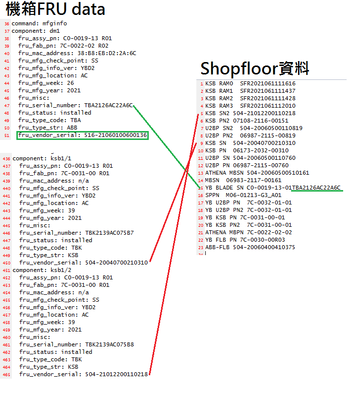

# YB SN Check Program
Compare and check fru log & Shop floor data
## Build Environment
* gcc.exe (Rev8, Built by MSYS2 project) 11.2.0
## Usage
1. Save shop floor ABB.xls as .txt (UTF-8, separate by tab).
2. Open SN_Check.exe
3. Enter FRU.log & shop floor ABB.txt (Step 1) path.
4. Output will show on screen, logs will be saved in {FRU log name}_compare.txt
## Check list
|FRU data (ABB)|Shop floor data|
|--------|---------------|
|fru_serial_number|BLADE SN|
|fru_fab_pn|ATHENA MBPN|

|FRU data (KSB)|Shop floor data|
|--------|---------------|
|fru_vendor_serial (KSB/1)|KSB SN 1|
|fru_vendor_serial (KSB/2)|KSB SN 2|
|fru_fab_pn (KSB/1)|KSB PN 1|
|fru_fab_pn (KSB/2)|KSB PN 2|

## Reference

* [FRU data](./data/516-220114003ABB.xls)
    > The fru_vender_serial in component dm is matched to first column in shop floor data.
* [Shop floor data](./data/LOG)
    > `R01` `R02` in FRU data is matched to `-01` `-02` in shopfloor data. 